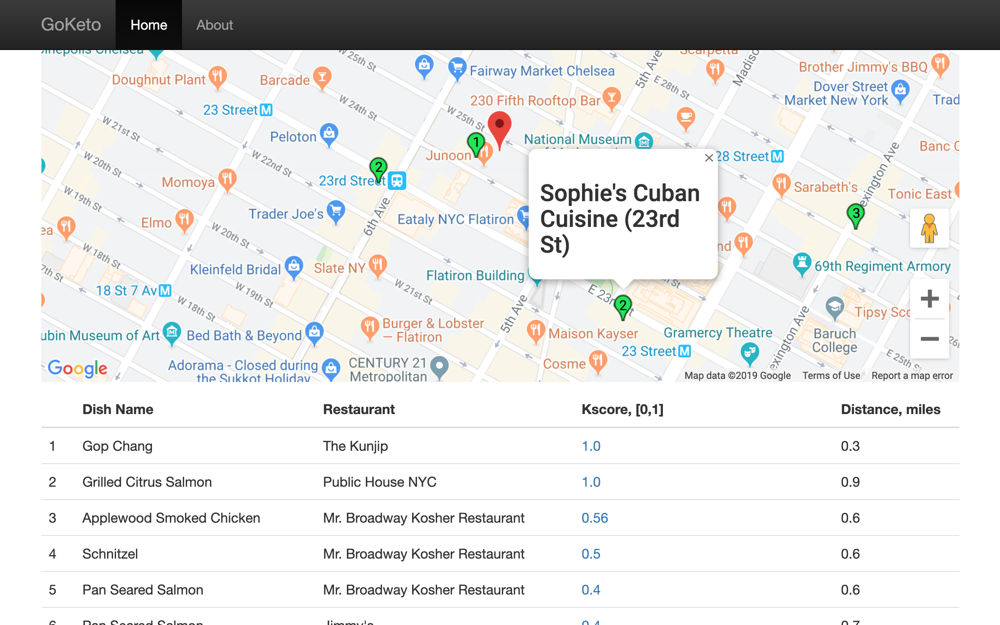

# GoKeto-webapp
This webapp is the main product of a Data Science project built for the Insight Data science fellows program in NYC.

The app consists of an NLP-based meal finder for Ketogenic dieters. 
A user inputs his/her address and GoKeto finds close-by meal options suitable to the Ketogenic diet inferred from local restaurant and nutritional information databases.
